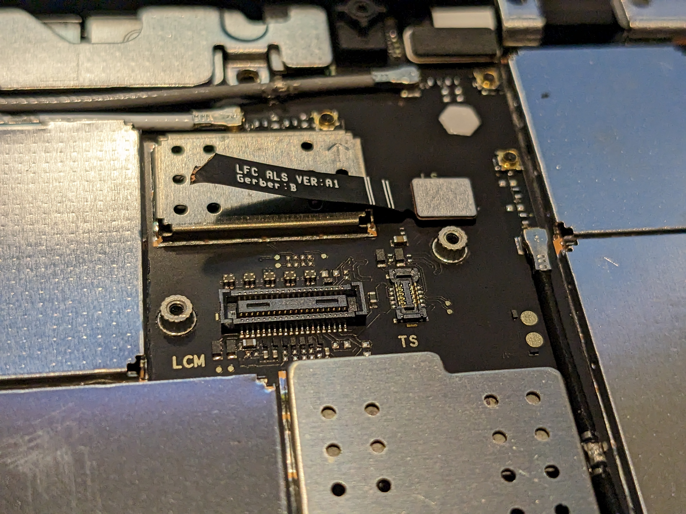

# Messing Around With The Light L16, Lumen, and More

So... I was browsing twitter aimlessly, as one does at four AM.  Trying to make the best of things.

And I came across this.

https://twitter.com/Tauss_srgl/status/1661925079754874880

The Light L16.  The camera with 16 eyes, that said "be not afraid" and personally took tryptophobics in an alley and beat them up for glancing at the camera their photographer was using.

Made in 20XX, it was produced by Light Co. before being homogenized by a very famous tractor DRM company whose name I won't say, oh deer.

Earlier in life I'd tried to make my own with USB stuff, a cursed camera for "synthetic imaging", a bunch of papers and... then ADHD indifference lead to them sitting by the wayside.  So what does the L16 do, how can we work around it being end of life'd, and what life does this silly camera still have to it?

## The Software - The Camera

At it's core, the Lumen L16 runs Android.  Android _6_.  Y'know, a version last security patch'd in 2018?  So this means you can get root on it, right?

Well, yes actually.  "bperryvolatile" on the XDA Developers forum found out that VIKIROOT "Dirty COW" _worked_ on the L16.  Which meant we could now get root on this cursed, arcane device.  So what can you do with that exactly?  Well, I popped a shell with it to find out... after backing up the firmware.  You see, because Light Labs Co. got bought out in 2022 by John Deere (https://www.news-jd.com/john-deere-acquires-light-a-company-that-specializes-in-depth-sensing-and-camera-perception-for-autonomous-vehicles/), lots of firmware, documentation, old versions, are all lost to time. 

Now, I wouldn't want to try and breach those patents, but supporting old hardware they sold is an admirable effort, so a user on GitHub by the name of "helloavo" made the L16 Archive;  a repo with as much archived information as they could find.  So, they had (as of time of recording (5/27/2023))... only version 1.3.5.1.  Now, when I unboxed my L16, I found it had version 1.3.25) still, so I dumped that for posterity much in the same way.

After that, I updated the firmware to latest, and many scary reboots later, I had a "latest good version" L16.

## Lumen

Poking at the desktop software though, it revealed some interesting things to start.  While the program installed to my desktop as a 32-bit app, it _gladly_ slurped up many gigabytes of memory, well past 4GiB.  This indicates that the latest version is, at a minimum, a 64bit app in some respects.  Awesome!

Inside program files we can find a _lot_ of files for QT, indicating that it was built using the QT Desktop framework, specifically QT5, version 5.11.1 according to the `maintinencetool.txt` file, used to install, update, and uninstall the tool.  Cool stuff.

Dropping the binary into Ghidra, linking it to the adjacent DLLs (shared libraries) revealed it is both a behemoth of an application, and that some amount of debug information is still embedded inside of it.  Not suprising, considering it's labeled as beta software and still has bugs that crash it completely.

A user by the name of "charlie-x" on GitHub apparently ran into a crash in a prior version with the versions of Eigen and Ceres packaged with it, both math and algebra libraries used to solve complex equations like those needed for the adjustment tools. (https://charliex2.wordpress.com/2017/12/06/light-co-l16-camera-fixing-the-lumen-software/)

In a fun twist, this user is _also_ the one who made eakins microscope control software, a project that very much inspired me to gut my second ever 3d printer to turn it into a scanning microscope, a project that now sits...very well abandoned.

*pat pat* it's okay, one day you'll get your turn.

## The Shoe

## Be Very Afraid; Internals Time

- FCC ID photos
- the chassis (machined aluminum?)
- a buttload of FPGAs

## The Firmware Update

file_contexts - 
    stmvl53l0 - ToF Sensor, referred to interally

> #line 1 "device/qcom/sepolicy/msm8996/file_contexts"

Uses the MSM8996 SoC from Qualcomm?
 - allegedly has an Android 10 build but no device specific antics.  rip.

 qbt1000 - qualcomm fingerprint sensor?

> jdi-bu21150       

Touchscreen driver.

> akm8973

hall effect sensor for compass

V4L2 enumeration (see screenshots, but only on 1.3.2.5 confirmed so far)

## L16 Unit Teardown Notes

> **Caution**

To actually disassemble the unit, you'll need a heat source of some kind (hot air station) and a minimum of Torx T5 drivers, a small phillips head with a fairly long shank, and tweezers to safely remove most of the scrwes and glued clips.

## Breaking The Unit

During disassembly, I broke my L16 in multiple ways. The first is "visually", by tearing up the rubber. The second, I snapped the display cables.  Proceed with caution.

## Rough Observations

It appears the back of the motherboard has discoloration from the heating and cooling of the FPGAs, near some mounting points, and near the test fingers on the back of the unit.  It's unclear whether a new unit from 2017 would have displayed the same discolorations.

### PCB Substrate

The printed circuit board itself bears the mark "AT&S MX5 SH, 94V-0 0418 2  .2"

The first part indicates the manufacturer of the PCB substrate itself was Austria Technologie & Systemtechnik Aktiengesellschaft, at least according to a quick search.

The wordmark of "AT&S" even resembles their logo very strongly, furthering the likelyhood this is correct.

### Battery

The battery is attached to the PCB via an FPC cable, that goes into the battery cell itself.  This battery is adhered to the face of the aluminum body itself via double-sided tape of some kind.  It is *very much* not intended for user removal.

This module connects next to the headphone connector, and the speaker attachment.  Look for the label "BAT" on the bottom right of the board, or see the photo used for the [USB C Connection](#usb-c-connection).

### FPGAs

If you wanted to see the FPGAs they advertise, they're under shields too, so you'll need to remove most of the parts from it to get those in an oven or under a heatgun to safely remove them.  I still haven't yet.

### Contact Sensor (?)

This small apparatus is connected via a board mount connector, which can trivially be removed with tweezers.  Simply grab it near the connector attachment and lift with tweezers.  This part's screws should be relatively simple to remove.

### Wireless Antenna Cables

The unit has three wireless antennas that are held in place with a combination of RF shields, stiffening apparatuses, and board-mounted wire clips.  Many of them can be removed with tweezers, though to remove the antenna cables completely you'll likely have to remove some shielding.

### Wireless Antennas Themselves

To remove these, you'll likely end up bending them.  Once the grip piece is removed, all of their external fastening is visible.  Use tweezers to bend the PCB away from the frame to loosen the adhesives.  These are VERY fragile, and likely to bend at a minimum.  Flexing back into place should still be viable.

### USB C Connection

Interestingly, there appears to be the use of kapton tape on the PCB to insulate the potential short between the spreader on top of it, and the USB C connector itself.

Also visible in this photo are the spring fingers for the speaker module, and the battery connection internally.

## Speaker Module

The haptic module is cleverly attached with three screws; two into the motherboard via PEM nuts of some kind (very small), and one Torx into the actual metal frame of the unit. 

## Microphone Module

The microphone is internal to the unit, is a single source, located near the top edge of the board.  It in theory would be removable and replacable with an external line in, though this is hardly a design consideration that video mode was barely into beta by the time they discontinued the unit.

## Shoe Connector / External Battery Connector

It appears that the battery connector described in the FCC filings as for "accessories" on their website, was labeled on the silkscreen of the connection as a "external battery connector".  The pinout connections are not yet obvious or clear.

## Wrist Strap Attachment

To gain access to the unit, remove these two Torx screws.

## Onboard Memory

The unit's memory is under the three center heatspreaders, in three discrete ICs.  They're NANYA 1720s, NT6CL128T64B4-H2, with the markings below that being 70837000EW  L   TW

See photo for more.

Also under a heatshield is the SKhynix H9HKNNNCUUMU BRNMH 706A, or about 4GB of onboard memory.

Also visible in the photo is the Qualcomm PM8996 CPU and the QCA6174A wireless IC.

Also inside the unit is the "KLUEG8U1EM-B0B1" IC from Samsung, presumably a memory controller of some kind.

## Display Removal (UNFINISHED)

To remove the display module, you'll need to have first removed the two Torx from the wrist-strap attachment, heatgun and then peel back the adhesive on the "front" of the camera (the side without the detent), then remove the other three Torx screws.  Using a spudger, gently pry the piece near the bottom right of the camera, across the vertical side from the wrist strap. This piece is snapped in.  Ensure the top lip is NOT removed during this part.  

Gently pry it across to produce a lip.

To remove the FPC cables for the display, you'll need to gently lift the "bottom" of the display module towards you.  If you don't have enough room, make sure the case fasteners on the left of the unit are completely removed.  You can also *carefully* remove the snaps on the top left of the screen, but be careful to not break the FPC cables.

You'll need a relatively short phillips head screwdriver to unscrew the shields for retaining the display FPCs.  Remove the four screws, and then use tweezers to *gingerly* remove the FPCs.  The display module should now be carefully removed.

Following this, you'll need to also make sure you've removed the left-side camera grip, and when doing so make sure to get underneath the plastic piece, not the rubber one.

> **Caution**

Getting underneath the rubber will rip it and render your unit unable to be reassembled looking the same.
